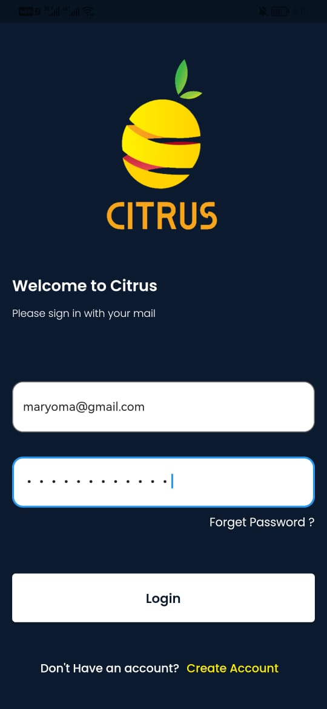
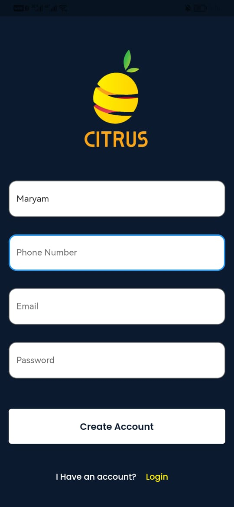
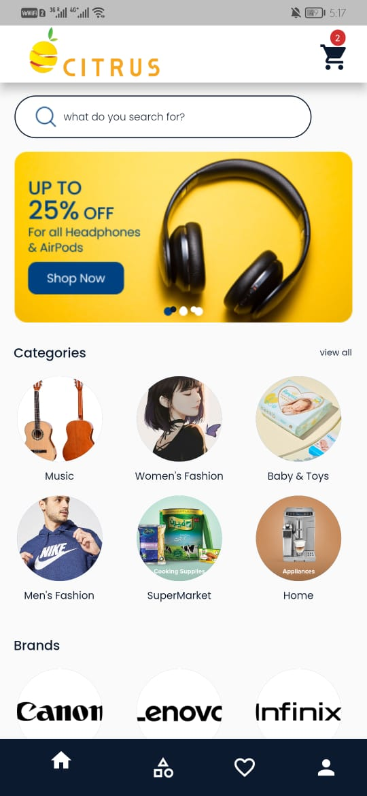
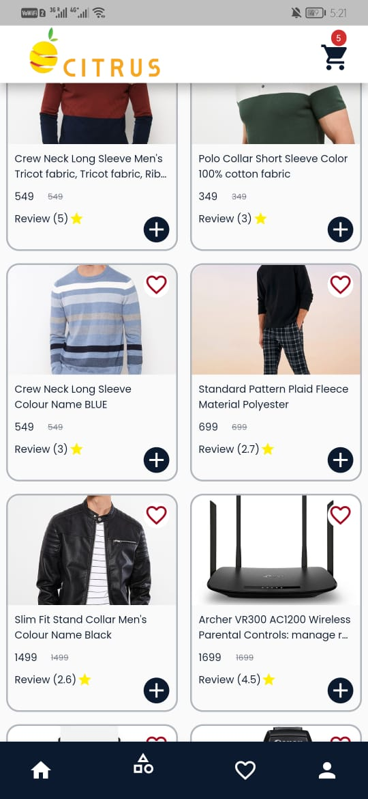
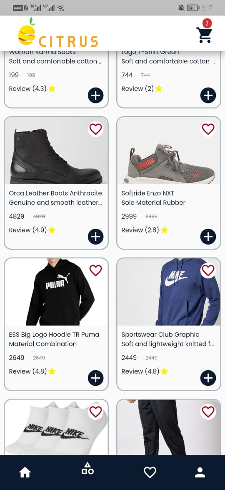
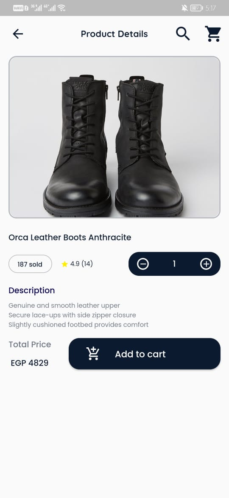
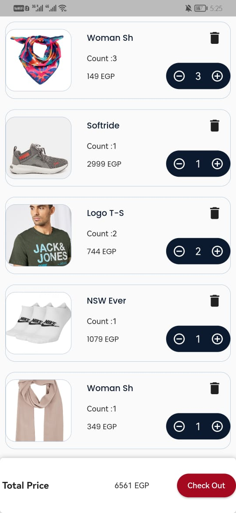
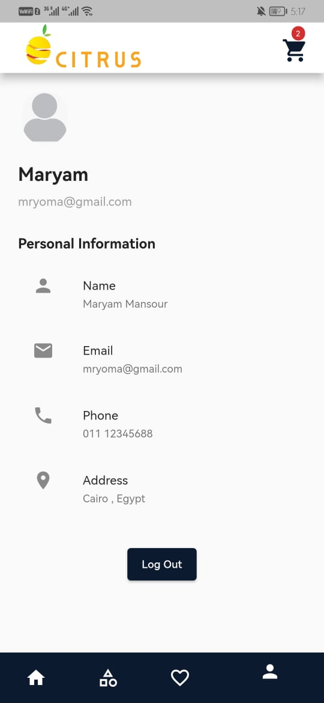

# 🛍️🍋 Citrus  -FlutterApp

Citrus is a feature-rich e-commerce Flutter app that allows users to shop for clothing, beauty products, and more. The app is built using the Clean Architecture pattern, employs the Bloc and Cubit state management system, and handles API requests with the Dio package.
Users can perform various actions such as login, signup, signout, search, browse categories and brands, add products to the cart, update or delete items in the cart, and add items to their favorite list.

##  Features

-User authentication (login, signup, and signout).  
-Persistent login using SharedPreferences.  
-Browse and search for products by categories or brands.    
-Add products to the cart.  
-Update or delete items in the cart.  
-Add products to the favorite list.  
-API handling with Dio package using the following API Documentation.  
-Utilize the BLoC and Cubit state management patterns with the bloc and flutter_bloc packages.  
-Use Dartz for functional programming.  
-Enhance typography with Google Fonts.  
-Adapt to different screen sizes and orientations with flutter_screenutil.  
-Display image slideshows with flutter_image_slideshow.  
-Check internet connectivity with internet_connection_checker.  

##  Resources

- API: https://documenter.getpostman.com/view/5709532/2s8Z75SVbe

---

## 📸 Screenshots

Click to expand

### Login Screen $~~~~~~~~~~~$  $~~~~~~~~~~~$ signup Screen

$~~~~~~~~~~~$

### Home Screen

### products Screen

### Product Details Screen
 

### cart Screen

### profile Screen

